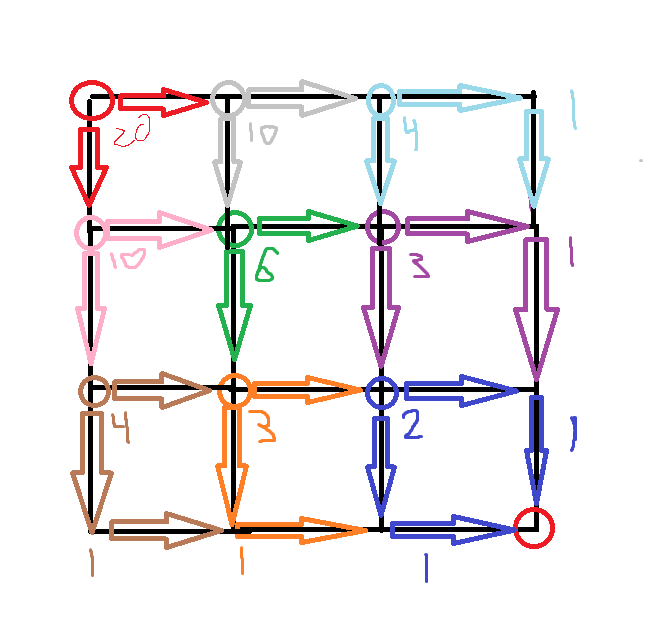

# Problem 15

[Link to Problem](https://projecteuler.net/problem=15)

## Lattice paths

```
Starting in the top left corner of a 2×2 grid, and only being able to move to the right and down, there are exactly 6 routes to the bottom right corner.
<div style="text-align:center;">
</div>
How many such routes are there through a 20×20 grid?

```

### Thought Process

Dynamic programming baby!!

